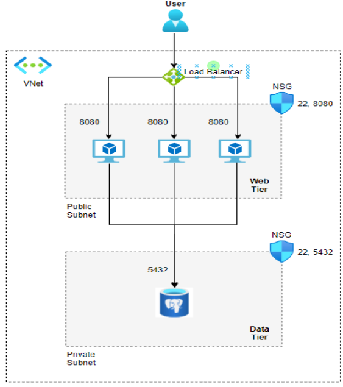

### Terraform Exercise solution  


### Installation  
To install the infrastructure, run the following commands in a terminal:  
    
```
git clone https://gitlab.com/sela-1090/students/lioratari/terraform.git  
    
cd terraform-infrastructure  
```
Then, open a terminal in the terraform directory and run the following command:  
    
```
terraform init  
terraform plan -out <name for the plan>  
terraform apply <name of the plan created>
```




